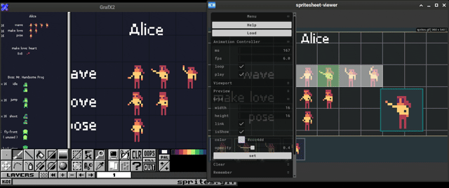

# Spritesheet Viewer for Grafx2

This was made while I was participating in the js13kGames 2025 game jam.

I mainly create all my art and animations using GrafX2. GrafX2 is really great for pixel art—it's like Vim for pixel artists. It has saved me a lot of time.

However, the downside is that it lacks proper animation tools, like the timeline feature you see in Aseprite or Flash. It does have its own animation setup, but it's not ideal for editing complex or heavy sprites.

So, to fill that gap, I wrote this tool.




## ✨ Features

- **Live Preview:** Edit your sprites in GrafX2, select frames, and preview animations instantly.
- **Easy Upload:** Drag and drop images or upload via the menu.
- **Auto-Reload:** Changes in your image file update automatically in the viewer.
- **Flexible Export:** Export selected frames as PNG sequences, GIFs, or a spritesheet.
- **Grid Selection:** Set grid dimensions to select frames and play animations.
- **Frame Selection:** Ctrl+Click or Shift+Click to select/deselect frames or regions.
- **Zoom & Pan:** Mouse wheel to zoom, click and drag to pan.
- **Keyboard Controls:** Spacebar to play/pause, arrow keys to navigate frames.
- **Settings Memory:** Save your settings for future uploads.
- **FFmpeg Integration:** Export GIFs directly (FFmpeg included in container builds).

---


## 📦 Prebuilt Packages

Download ready-to-use builds from the [Releases](https://github.com/smiley405/spritesheet-viewer/releases) page for Windows and Linux. Just download and run the package for your platform.

---


## 🆘 Quick Help

- **Upload:** Drag and drop a file into the viewport or use **Menu → Upload**
- **Grid Selection:**
  - `Ctrl + Left Click` to select/deselect a frame
  - `Shift + Left Click` to select a rectangular region
- **Zoom:** Mouse wheel
- **Pan:** Click and drag with left mouse button
- **Play/Pause:** Spacebar
- **Remember Settings:** Use **Menu → Remember Settings**
- **Export GIFs:** FFmpeg is required (included in container builds)
- **Frame Navigation:**
  1. Click a frame in the collection
  2. Press `Z` and Left Click in the viewport
  3. Use `←` and `→` arrow keys

---


## 🧪 Development: Run Locally

Clone the repository and start the development server:

```bash
git clone https://github.com/smiley405/spritesheet-viewer.git
cd spritesheet-viewer
npm install
npm run dev
```

This project was made during a game jam, so there may be minor bugs or areas for improvement. Contributions and pull requests are welcome!


## 🐳 Building with Docker or Podman

This project includes a `Dockerfile` for building Windows and Linux packages using [electron-builder](https://www.electron.build/). Wine and FFmpeg are installed in the container for Windows packaging and GIF export.

### 🔧 Requirements

- **Fedora:** Use [Podman](https://podman.io/)
- **Other Linux/macOS/Windows:** Use [Docker](https://www.docker.com/)

> ✅ FFmpeg is installed inside the container and available during build and runtime — no need to install it on your host system.

### 🚀 Build Instructions

#### Podman (Fedora)

```bash
podman build -t spritesheet-builder .
podman run --rm -v $(pwd):/app:Z spritesheet-builder
```

or simply run:
```bash
npm run podman:build
```

#### Docker (Other platforms)

```bash
docker build -t spritesheet-builder .
docker run --rm -v $(pwd):/app spritesheet-builder
```

or simply run:
```bash
npm run docker:build
```

#### 📦 Output

After running the container, you'll find these files in your `dist/` directory:

```
Spritesheet Viewer-vX.X.X-win.zip
Spritesheet Viewer-vX.X.X-linux.AppImage
Spritesheet Viewer-vX.X.X-linux.zip
```

Ready-to-distribute builds for Windows and Linux.


## 📚 Dependencies

- [Electron](https://github.com/electron/electron) — Desktop app framework
- [tweakpane](https://github.com/cocopon/tweakpane) — Menu UI
- [panzoom](https://github.com/timmywil/panzoom) — Viewport drag & pan
- [FFmpeg](https://github.com/FFmpeg/FFmpeg) — GIF export (bundled in container; install manually if building outside)

